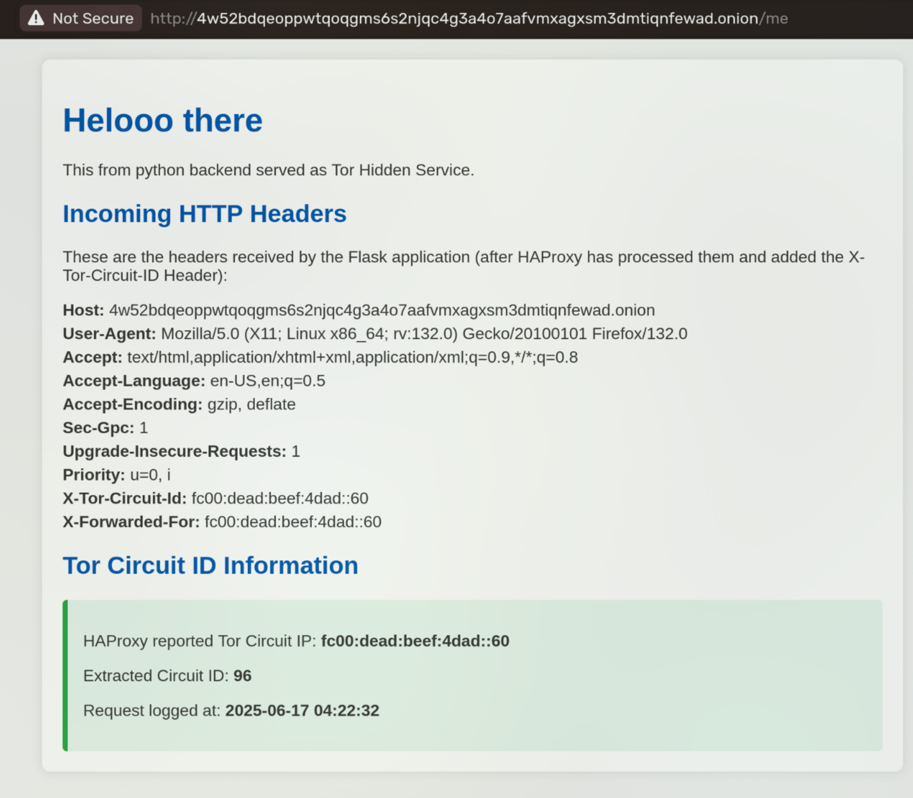
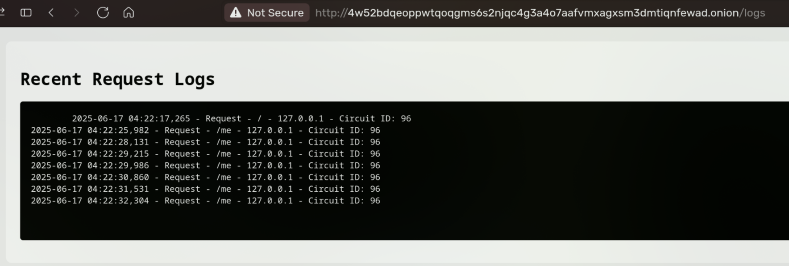

# Tor Hidden Servcie with ClientID exposed to backend

Backend is using simple flask web server that parse haproxy headers to get the correct ClientID and decode it according to man page:  
```man
 a header line when a client is connecting to the onion service. The header will look like this:

           "PROXY TCP6 fc00:dead:beef:4dad::ffff:ffff ::1 65535 42\r\n"

           We encode the "global circuit identifier" as the last 32-bits of the first IPv6 address. All other
           values in the header can safely be ignored. You can compute the global circuit identifier using the
           following formula given the IPv6 address "fc00:dead:beef:4dad::AABB:CCDD":

           global_circuit_id = (0xAA << 24) + (0xBB << 16) + (0xCC << 8) + 0xDD;

           In the case above, where the last 32-bits are 0xffffffff, the global circuit identifier would be
           4294967295. You can use this value together with Tor’s control port to terminate particular circuits
           using their global circuit identifiers. For more information about this see control-spec.txt.

           The HAProxy version 1 protocol is described in detail at
           https://www.haproxy.org/download/1.8/doc/proxy-protocol.txt
```

The Extraction is done using the haproxy headers sent in the function `def extract_circuit_id(proxy_ip):` on line 25

## Build
- `docker build -t torhs .`
## Run
- `docker run -p 8000:8000 torhs`  
### You can see after tor finish Bootstrapping your onion address if you missed it go to `127.0.0.1:8000/onion` in your browser or use curl
- `curl 127.0.0.1:8000/onion`

### Once you get the onion url visit `<onion>/me` to see your clientID
### visit `<onion>/logs` to see all requests logged

## How-to
0. Run tor and config it with  
    `HiddenServiceExportCircuitID haproxy`
1. install haproxy
2. config haproxy to accept traffic and forward it to your backend while setting the header using the following line  
    `http-request set-header X-Tor-Circuit-ID %[src]`
3. Run your backend on the specifed port and test it with curl 
4. In your backend look for the header `X-Tor-Circuit-ID`
5. Decode the value sent from haproxy following the man page formula python example  
    ```python
        ip = ipaddress.IPv6Address(proxy_ip)
        # Last 32 bits
        words = ip.exploded.split(":")[-2:]
        hex_val = "".join(words)
        return int(hex_val, 16)
    ```

### Both tor and haproxy configs are attached as well as a docker for easy run

## Demo


